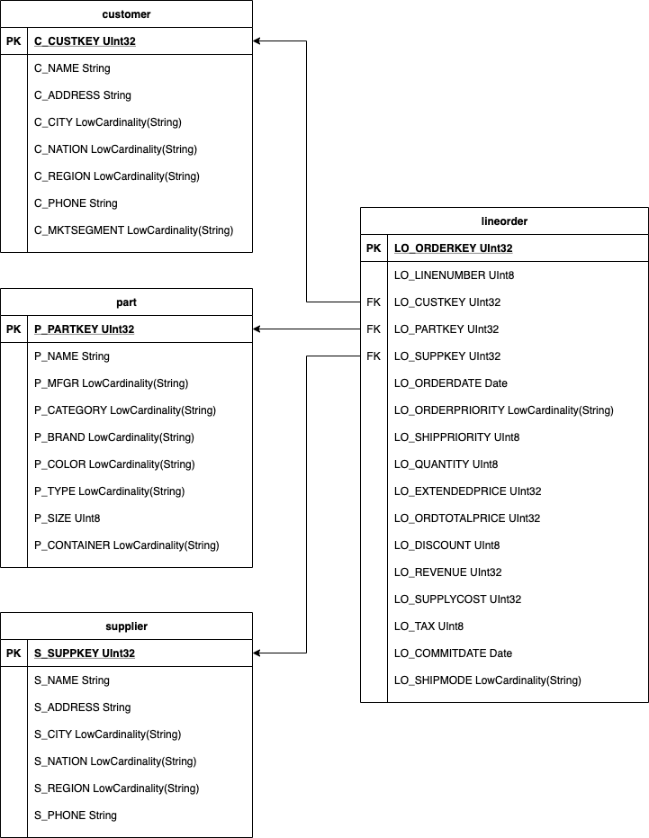

## Datasets
[reference](https://clickhouse.tech/docs/en/getting-started/example-datasets/star-schema/)

### Generating data:
```bash
$ ./dbgen -s 1000 -T c # customer
$ ./dbgen -s 1000 -T l # lineorder
$ ./dbgen -s 1000 -T p # part
$ ./dbgen -s 1000 -T s # supplier
$ ./dbgen -s 1000 -T d # date
```

### Creating tables in ClickHouse:

```sql
CREATE TABLE customer
(
        C_CUSTKEY       UInt32,
        C_NAME          String,
        C_ADDRESS       String,
        C_CITY          LowCardinality(String),
        C_NATION        LowCardinality(String),
        C_REGION        LowCardinality(String),
        C_PHONE         String,
        C_MKTSEGMENT    LowCardinality(String)
)
ENGINE = MergeTree ORDER BY (C_CUSTKEY);

CREATE TABLE lineorder
(
    LO_ORDERKEY             UInt32,
    LO_LINENUMBER           UInt8,
    LO_CUSTKEY              UInt32,
    LO_PARTKEY              UInt32,
    LO_SUPPKEY              UInt32,
    LO_ORDERDATE            Date,
    LO_ORDERPRIORITY        LowCardinality(String),
    LO_SHIPPRIORITY         UInt8,
    LO_QUANTITY             UInt8,
    LO_EXTENDEDPRICE        UInt32,
    LO_ORDTOTALPRICE        UInt32,
    LO_DISCOUNT             UInt8,
    LO_REVENUE              UInt32,
    LO_SUPPLYCOST           UInt32,
    LO_TAX                  UInt8,
    LO_COMMITDATE           Date,
    LO_SHIPMODE             LowCardinality(String)
)
ENGINE = MergeTree PARTITION BY toYear(LO_ORDERDATE) ORDER BY (LO_ORDERDATE, LO_ORDERKEY);

CREATE TABLE part
(
        P_PARTKEY       UInt32,
        P_NAME          String,
        P_MFGR          LowCardinality(String),
        P_CATEGORY      LowCardinality(String),
        P_BRAND         LowCardinality(String),
        P_COLOR         LowCardinality(String),
        P_TYPE          LowCardinality(String),
        P_SIZE          UInt8,
        P_CONTAINER     LowCardinality(String)
)
ENGINE = MergeTree ORDER BY P_PARTKEY;

CREATE TABLE supplier
(
        S_SUPPKEY       UInt32,
        S_NAME          String,
        S_ADDRESS       String,
        S_CITY          LowCardinality(String),
        S_NATION        LowCardinality(String),
        S_REGION        LowCardinality(String),
        S_PHONE         String
)
ENGINE = MergeTree ORDER BY S_SUPPKEY;
```

### Inserting data:
```bash
$ clickhouse-client --query "INSERT INTO customer FORMAT CSV" < customer.tbl
$ clickhouse-client --query "INSERT INTO part FORMAT CSV" < part.tbl
$ clickhouse-client --query "INSERT INTO supplier FORMAT CSV" < supplier.tbl
$ clickhouse-client --query "INSERT INTO lineorder FORMAT CSV" < lineorder.tbl
```

### Converting “star schema” to denormalized “flat schema”:
```sql
SET max_memory_usage = 20000000000;

CREATE TABLE lineorder_flat
ENGINE = MergeTree
PARTITION BY toYear(LO_ORDERDATE)
ORDER BY (LO_ORDERDATE, LO_ORDERKEY) AS
SELECT
    l.LO_ORDERKEY AS LO_ORDERKEY,
    l.LO_LINENUMBER AS LO_LINENUMBER,
    l.LO_CUSTKEY AS LO_CUSTKEY,
    l.LO_PARTKEY AS LO_PARTKEY,
    l.LO_SUPPKEY AS LO_SUPPKEY,
    l.LO_ORDERDATE AS LO_ORDERDATE,
    l.LO_ORDERPRIORITY AS LO_ORDERPRIORITY,
    l.LO_SHIPPRIORITY AS LO_SHIPPRIORITY,
    l.LO_QUANTITY AS LO_QUANTITY,
    l.LO_EXTENDEDPRICE AS LO_EXTENDEDPRICE,
    l.LO_ORDTOTALPRICE AS LO_ORDTOTALPRICE,
    l.LO_DISCOUNT AS LO_DISCOUNT,
    l.LO_REVENUE AS LO_REVENUE,
    l.LO_SUPPLYCOST AS LO_SUPPLYCOST,
    l.LO_TAX AS LO_TAX,
    l.LO_COMMITDATE AS LO_COMMITDATE,
    l.LO_SHIPMODE AS LO_SHIPMODE,
    c.C_NAME AS C_NAME,
    c.C_ADDRESS AS C_ADDRESS,
    c.C_CITY AS C_CITY,
    c.C_NATION AS C_NATION,
    c.C_REGION AS C_REGION,
    c.C_PHONE AS C_PHONE,
    c.C_MKTSEGMENT AS C_MKTSEGMENT,
    s.S_NAME AS S_NAME,
    s.S_ADDRESS AS S_ADDRESS,
    s.S_CITY AS S_CITY,
    s.S_NATION AS S_NATION,
    s.S_REGION AS S_REGION,
    s.S_PHONE AS S_PHONE,
    p.P_NAME AS P_NAME,
    p.P_MFGR AS P_MFGR,
    p.P_CATEGORY AS P_CATEGORY,
    p.P_BRAND AS P_BRAND,
    p.P_COLOR AS P_COLOR,
    p.P_TYPE AS P_TYPE,
    p.P_SIZE AS P_SIZE,
    p.P_CONTAINER AS P_CONTAINER
FROM lineorder AS l
INNER JOIN customer AS c ON c.C_CUSTKEY = l.LO_CUSTKEY
INNER JOIN supplier AS s ON s.S_SUPPKEY = l.LO_SUPPKEY
INNER JOIN part AS p ON p.P_PARTKEY = l.LO_PARTKEY;
```

### Running the queries:
```sql
SELECT sum(LO_EXTENDEDPRICE * LO_DISCOUNT) AS revenue
FROM lineorder_flat
WHERE toYear(LO_ORDERDATE) = 1993 AND LO_DISCOUNT BETWEEN 1 AND 3 AND LO_QUANTITY < 25;

SELECT
    C_NATION,
    S_NATION,
    toYear(LO_ORDERDATE) AS year,
    sum(LO_REVENUE) AS revenue
FROM lineorder_flat
WHERE C_REGION = 'ASIA' AND S_REGION = 'ASIA' AND year >= 1992 AND year <= 1997
GROUP BY
    C_NATION,
    S_NATION,
    year
ORDER BY
    year ASC,
    revenue DESC;

SELECT
    toYear(LO_ORDERDATE) AS year,
    S_CITY,
    P_BRAND,
    sum(LO_REVENUE - LO_SUPPLYCOST) AS profit
FROM lineorder_flat
WHERE S_NATION = 'UNITED STATES' AND (year = 1997 OR year = 1998) AND P_CATEGORY = 'MFGR#14'
GROUP BY
    year,
    S_CITY,
    P_BRAND
ORDER BY
    year ASC,
    S_CITY ASC,
    P_BRAND ASC;
```

# Storage Policy
```sql
DROP TABLE IF EXISTS table_with_non_default_policy;

CREATE TABLE IF NOT EXISTS table_with_non_default_policy (
    EventDate Date,
    OrderID UInt64,
    BannerID UInt64,
    SearchPhrase String
) ENGINE = MergeTree
ORDER BY (OrderID, BannerID)
PARTITION BY toYYYYMM(EventDate)
SETTINGS storage_policy = 'moving_from_ssd_to_hdd';

SELECT * FROM table_with_non_default_policy;
SELECT * FROM `system`.disks;
SELECT * FROM `system`.storage_policies;
SELECT `partition`, name, part_type, active, `path`, disk_name FROM `system`.parts WHERE `table` = 'table_with_non_default_policy';

INSERT INTO table_with_non_default_policy VALUES ('2020-11-18', 123, 456, 'taotao');

ALTER TABLE table_with_non_default_policy MOVE PART '202011_1_2_1' TO VOLUME 'hot';
ALTER TABLE table_with_non_default_policy MOVE PARTITION '20201111' TO DISK 'ssd';
```